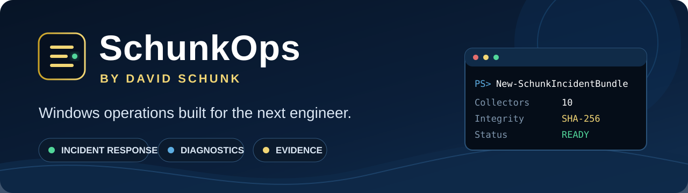

<p align="center">
  
</p>

# Windows IT Toolkit — by David Schunk

> **Personal project notice:** This repository is independently maintained in a personal/open-source capacity and is not affiliated with, sponsored by, or endorsed by any current or former employer. It is intended to contain only generic, reusable administration tooling and examples. Do not contribute employer confidential or proprietary information, non-public internal configurations, customer data, credentials, employer source code, or employer work product.

[](https://github.com/dschunk)
[](LICENSE)
[](https://github.com/dschunk/windows-it-toolkit/actions/workflows/validate-powershell.yml)
[](https://github.com/dschunk/windows-it-toolkit/actions/workflows/validate-module.yml)

**A practical Windows operations center for help desk technicians, sysadmins, infrastructure engineers, and incident responders.**

The goal is simple: make common Windows troubleshooting and evidence collection fast, readable, safe, and easy to hand off to the next engineer.

## Start here by role

| You are... | Start with... | Why |
|---|---|---|
| **Help desk / desktop support** | [`docs/HELPDESK.md`](docs/HELPDESK.md) | Five-minute triage, DNS, domain trust, SMB, RDP, escalation evidence |
| **Windows sysadmin** | `Get-SchunkEndpointTriage` | One-screen endpoint/server health and configuration context |
| **Server engineer** | `Get-SchunkServerHealth` + `New-SchunkIncidentBundle` | Repeatable server evidence instead of screenshots |
| **AD / identity engineer** | `Get-SchunkADReplicationHealth` + `Get-SchunkDomainTrustStatus` | Replication, trust, DC discovery, and reachability |
| **Security / incident response** | [`docs/INCIDENT-RESPONSE.md`](docs/INCIDENT-RESPONSE.md) | Structured evidence with timestamps and SHA-256 hashes |
| **Automation engineer** | `Import-Module SchunkOps` | Twenty object-producing commands designed for pipelines and runbooks |

## Five-minute help desk triage

When a user says “my computer is broken,” start with one command:

```powershell
Get-SchunkEndpointTriage
```

It collects the first-contact signals technicians usually hunt down manually:

- uptime and last boot
- memory pressure
- disk capacity
- active IPv4, gateway, DHCP, and DNS configuration
- domain membership and machine secure-channel state
- pending reboot state
- Windows Time source
- stopped automatic services
- recent System and Application critical/error counts

Need something you can attach to a ticket?

```powershell
Get-SchunkEndpointTriage |
    ConvertTo-Json -Depth 6 |
    Set-Content .\endpoint-triage.json
```

Then use the complete [SchunkOps Help Desk Field Guide](docs/HELPDESK.md) for “slow PC,” DNS, trust relationship, mapped drive, RDP, privilege, and escalation workflows.

## Start here: the 15-minute incident triage

When a Windows server is failing and the handoff needs evidence instead of screenshots, SchunkOps can collect a structured bundle in one command:

```powershell
New-SchunkIncidentBundle -OutputPath C:\IR\INC-0042 -Profile Full
```

The bundle contains separate JSON evidence files, per-collector status, record counts, timestamps, and SHA-256 integrity hashes. Standard bundles include endpoint triage, server health, reboot state, listening ports, event triage, and service failures. Full bundles add trust state, local administrators, installed software, updates, scheduled tasks, failed logons, and BitLocker inventory.

Capture the system again after remediation and compare what changed:

```powershell
Compare-SchunkIncidentBundle `
    -ReferencePath C:\IR\INC-0042 `
    -DifferencePath C:\IR\INC-0042-After
```

Follow the complete, safety-conscious [15-minute Windows incident triage](docs/INCIDENT-RESPONSE.md).

## SchunkOps PowerShell module

**SchunkOps** is the curated, installable module edition of this toolkit. Version **1.1.0** exports **20** public commands covering endpoint triage, Windows server health, networking, DNS, identity, Active Directory, security evidence, and incident response.

Until the Gallery release is published, clone and import directly:

```powershell
git clone https://github.com/dschunk/windows-it-toolkit.git
Import-Module .\windows-it-toolkit\module\SchunkOps\SchunkOps.psd1
Get-Command -Module SchunkOps
```

Once published to the PowerShell Gallery:

```powershell
Install-Module SchunkOps -Scope CurrentUser
Import-Module SchunkOps
```

### Twenty operational commands

| Command | Operational use |
|---|---|
| **Get-SchunkEndpointTriage** | One-command first look for help desk and endpoint/server escalation |
| **Get-SchunkDomainTrustStatus** | Domain membership, secure channel, logon/DC discovery, optional AD port checks |
| **Test-SchunkDnsClient** | Query every DNS server configured on the endpoint and compare answers/latency |
| **Get-SchunkADReplicationHealth** | Summarize DC replication failures, failed partners, and stale success intervals |
| **Get-SchunkLocalAdministrator** | Inventory local Administrators membership locally or through PowerShell remoting |
| **Get-SchunkDiskPressure** | Flag fixed disks by warning and critical free-space thresholds |
| **New-SchunkIncidentBundle** | Coordinated JSON evidence collection with SHA-256 integrity hashes |
| **Compare-SchunkIncidentBundle** | Compare two bundle manifests and identify changed evidence sets |
| **Get-SchunkLogonFailure** | Group failed authentications by identity, source, event, and reason |
| **Get-SchunkServiceFailure** | Find stopped automatic services and recent Service Control Manager failures |
| `Get-SchunkServerHealth` | Uptime, CPU, memory, disks, services, and recent system errors |
| `Test-SchunkNetworkPath` | DNS, ICMP, TCP reachability, and latency |
| `Test-SchunkTlsEndpoint` | TLS protocol, certificate identity, expiry, and response time |
| `Get-SchunkPendingReboot` | Evidence from five Windows reboot indicators |
| `Get-SchunkListeningPort` | TCP/UDP listeners mapped to owning processes |
| `Get-SchunkEventTriage` | Grouped Windows warnings and errors |
| `Get-SchunkInstalledSoftware` | Side-effect-free 32/64-bit software inventory |
| `Get-SchunkWindowsUpdateHistory` | Windows Update installation and removal history |
| `Get-SchunkScheduledTaskAudit` | Task identity, elevation, actions, and results |
| `Get-SchunkBitLockerInventory` | Encryption, protection, and recovery-key presence |

Every command includes discoverable help:

```powershell
Get-Help about_SchunkOps
Get-Help Get-SchunkEndpointTriage -Full
Get-Help Get-SchunkADReplicationHealth -Full
```

Release instructions and secret requirements are documented in [docs/PUBLISHING.md](docs/PUBLISHING.md).

## Common IT workflows

### Trust relationship failure

```powershell
Get-SchunkDomainTrustStatus
Get-SchunkDomainTrustStatus -TestPorts
Test-SchunkDnsClient -Name _ldap._tcp.dc._msdcs.contoso.com -Type SRV
```

The trust command is deliberately read-only. It does **not** reset the machine account, rejoin the domain, or change DNS.

### “Works by IP, fails by hostname”

```powershell
Test-SchunkDnsClient -Name fileserver.contoso.com
Test-SchunkNetworkPath -ComputerName fileserver.contoso.com -Port 445
```

### Active Directory replication

```powershell
Get-SchunkADReplicationHealth |
    Format-Table DomainController,Site,Status,FailedPartnerCount,RecordedFailureCount,LargestReplicationAgeMinutes -AutoSize
```

### Local admin review

```powershell
Get-SchunkLocalAdministrator -ComputerName PC001,PC002,SERVER01
```

### Disk pressure

```powershell
Get-SchunkDiskPressure |
    Where-Object Status -ne 'OK' |
    Sort-Object FreePercent
```

## Standalone field tools

The repository also contains standalone `.ps1` tools for technicians who want one script without importing a module.

| Script | Purpose |
|---|---|
| Get-ServerHealth.ps1 | CPU, memory, disk, uptime, critical services, and recent system errors |
| Test-NetworkPath.ps1 | DNS, ICMP, TCP-port, and latency diagnostics |
| Get-CertificateExpiry.ps1 | Certificates approaching expiration |
| Find-LargeFiles.ps1 | Largest files beneath a path without modifying anything |
| Get-EventTriage.ps1 | Group recent warnings and errors into an actionable event summary |
| Get-SystemInventory.ps1 | Collect portable system, network, hotfix, and hardware inventory |
| Test-DnsResolution.ps1 | Compare DNS resolution, answers, failures, and response times |
| Test-TlsEndpoint.ps1 | Inspect TLS protocol, certificate identity, expiration, and response time |
| Get-PendingReboot.ps1 | Explain which Windows subsystem is requesting a restart |
| Get-ListeningPortReport.ps1 | Map listening TCP/UDP ports to processes and executable paths |
| Get-NtfsPermissionAudit.ps1 | Audit explicit and inherited NTFS access rules beneath a path |
| Test-ActiveDirectoryHealth.ps1 | Check domain controllers, LDAP reachability, sites, and replication freshness |
| Get-GroupPolicyInventory.ps1 | Inventory GPO ownership, status, versions, WMI filters, and modification dates |
| Get-LocalAdministrator.ps1 | Enumerate local Administrators membership locally or through PowerShell remoting |
| Get-InstalledSoftware.ps1 | Inventory 32-bit and 64-bit installed software without Win32_Product side effects |
| Test-SmbShareAccess.ps1 | Measure UNC read access and perform an optional reversible write probe |
| Get-ADUserLifecycleAudit.ps1 | Find inactive enabled users, old passwords, expired passwords, and non-expiring credentials |
| Get-StaleADComputer.ps1 | Identify inactive Active Directory computer objects with OS and logon context |
| Test-DomainControllerPorts.ps1 | Validate DNS, Kerberos, RPC, LDAP, SMB, LDAPS, and Global Catalog reachability |
| Get-DhcpScopeUtilization.ps1 | Report scope capacity, leases, reservations, and utilization percentages |
| Get-DnsZoneInventory.ps1 | Inventory DNS zones, update modes, replication scopes, and directory integration |
| Get-ScheduledTaskAudit.ps1 | Review task identity, elevation, actions, results, missed runs, and schedules |
| Get-WindowsUpdateHistory.ps1 | Read Windows Update installation history without scraping Event Viewer |
| Get-FirewallExposure.ps1 | Flatten effective firewall rules with ports, addresses, profiles, and programs |
| Get-BitLockerInventory.ps1 | Report encryption, protection, lock state, methods, and key-protector presence |
| Get-SmbShareInventory.ps1 | Inventory SMB configuration, encryption, caching, and share permissions |
| Get-UserProfileAudit.ps1 | Find large, old, loaded, and inactive local profiles |
| Test-TimeSynchronization.ps1 | Measure Windows time offsets against one or more systems |
| New-WindowsOpsSnapshot.ps1 | Run a coordinated set of collectors and export a timestamped JSON evidence bundle |
| Get-IISSiteInventory.ps1 | Inventory IIS sites, bindings, application pools, paths, runtime state, and logging |
| Get-HyperVInventory.ps1 | Report Hyper-V VM state, resources, checkpoints, disks, networking, and lifecycle actions |
| Get-PrintServerInventory.ps1 | Inventory printers, drivers, ports, sharing, publication, queues, and configuration |
| Test-RdpReadiness.ps1 | Validate RDP enablement, NLA, service state, firewall rules, port, and listener |
| Get-EventLogConfiguration.ps1 | Review event-log enablement, retention mode, capacity, records, and file locations |
| Get-EnvironmentPathAudit.ps1 | Detect missing, duplicate, and risky machine and user PATH entries |

Example standalone usage:

```powershell
.\Get-ServerHealth.ps1
.\Test-NetworkPath.ps1 -ComputerName server01 -Ports 53,80,443,3389
.\Get-CertificateExpiry.ps1 -Days 60
.\Find-LargeFiles.ps1 -Path C:\Logs -Top 25
.\Test-ActiveDirectoryHealth.ps1
.\Get-ADUserLifecycleAudit.ps1 -InactiveDays 90
.\Test-DomainControllerPorts.ps1
.\Get-FirewallExposure.ps1 -EnabledOnly
.\Test-TimeSynchronization.ps1 -ComputerName dc01,dc02
.\Test-RdpReadiness.ps1
```

Review the [requirements and privilege guide](docs/PRIVILEGES.md) before running domain, DHCP, DNS, BitLocker, firewall, or remote-management collectors.

## Design principles

SchunkOps is intentionally opinionated:

1. **Read-only by default.** Diagnostics should not accidentally become remediation.
2. **Return objects, not pretty text.** A technician can read it; an engineer can pipe it; automation can serialize it.
3. **Collect before changing.** Evidence is easiest to understand before someone “tries a few things.”
4. **Fail visibly.** Partial collection and errors belong in the output, not hidden behind a green check.
5. **Build for handoff.** The next person should understand what was checked and what was not changed.
6. **No phone-home telemetry.** The toolkit does not upload usage or operational data.

## Quality gates

Every push and pull request is parsed on a Windows runner and checked with PSScriptAnalyzer error rules. SchunkOps also validates its manifest, imports the module, compares declared and actual exports, checks command help/attribution, and runs Pester tests.

[](https://github.com/dschunk/windows-it-toolkit/actions/workflows/validate-powershell.yml)
[](https://github.com/dschunk/windows-it-toolkit/actions/workflows/validate-module.yml)

## Authorship and credit

Created and maintained by **David Maksim Schunk**. See [AUTHORS.md](AUTHORS.md), [CITATION.cff](CITATION.cff), and the [attribution guide](docs/ATTRIBUTION.md).

The MIT License permits broad personal and commercial use while requiring preservation of the copyright and license notice in copies or substantial portions. Preferred public credit:

> Based on the Windows IT Toolkit by David Schunk — https://github.com/dschunk/windows-it-toolkit

Adoption is measured transparently through GitHub stars, forks, clones, issues, contributors, releases, and PowerShell Gallery downloads.

The scripts use safe defaults, contain no credentials or environment-specific addresses, and return objects wherever practical. Review and test every script before production use.

Issues and pull requests are welcome. Never include real credentials, tokens, private hostnames, proprietary data, or employer confidential/work-product material in examples.

## Help build it

The [public roadmap](ROADMAP.md) includes fleet operations, baselines, reporting, redaction, schemas, tests, and good first contributions. Pull requests use a safety and quality checklist so new tools remain predictable under pressure.

**Collect first. Change second. Document always.**
